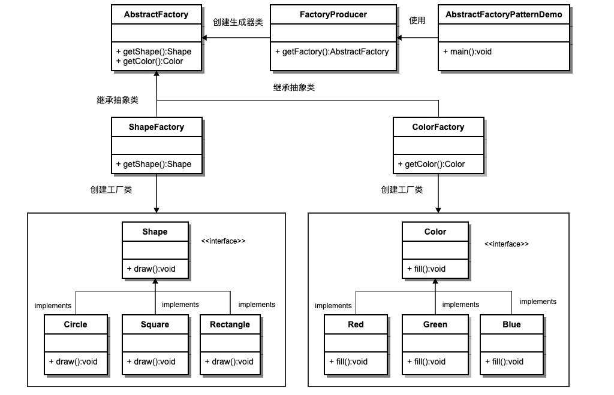
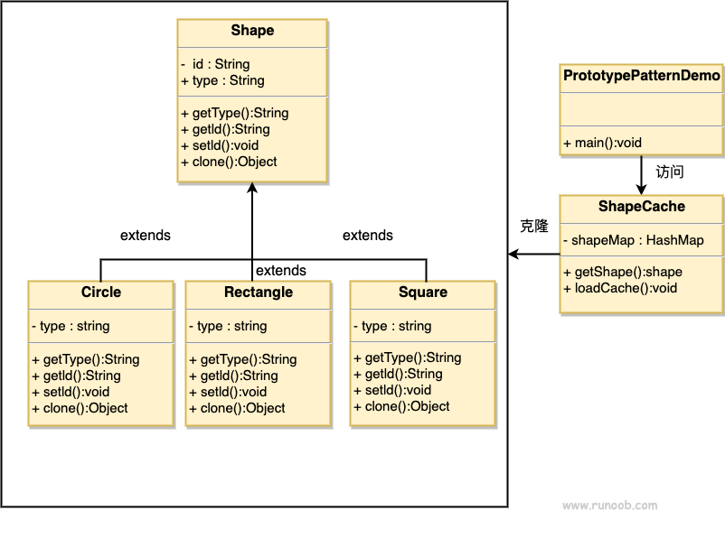
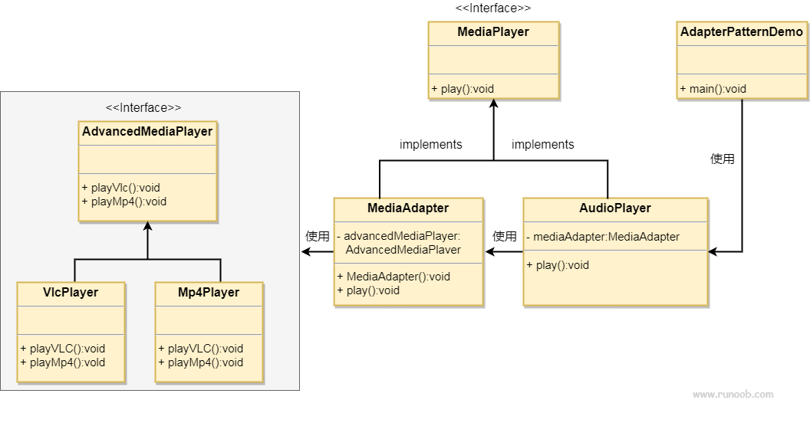
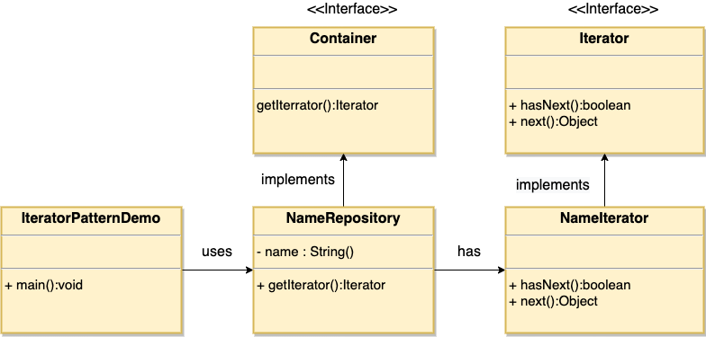

# design_pattern_python
设计模式-python， python design pattern,基于菜鸟教程的设计模式java实现进行了python重写 

[TOC]

## 写在前面

[菜鸟教程](https://www.runoob.com/design-pattern/design-pattern-tutorial.html) 中对常用的设计模式进行了汇总，实现上使用的是java。在本仓库里面对所有的教程涉及到的代码用python进行了重写，同样也有C++版本的实现在另一个仓库进行了管理
[C++ 设计模式](https://github.com/cf-zhang/design_patterns)

## [设计模式简介](https://www.runoob.com/design-pattern/design-pattern-intro.html)

## 创建型模式

这些设计模式提供了一种在创建对象的同时隐藏创建逻辑的方式，而不是使用 new 运算符直接实例化对象。这使得程序在判断针对某个给定实例需要创建哪些对象时更加灵活。	

### [工厂模式（Factory Pattern）](https://www.runoob.com/design-pattern/factory-pattern.html)

[factory_pattern.py](./factory_pattern.py)

### [抽象工厂模式（Abstract Factory Pattern）](https://www.runoob.com/design-pattern/abstract-factory-pattern.html)

[abstract_factory_pattern.py](./abstract_factory_pattern.py)

### [单例模式（Singleton Pattern）](https://www.runoob.com/design-pattern/singleton-pattern.html)

[singleton_pattern.py](./singleton_pattern.py)

### [建造者模式（Builder Pattern）](https://www.runoob.com/design-pattern/builder-pattern.html)

[build_pattern.py](./builder_pattern.py)

### [原型模式（Prototype Pattern）](https://www.runoob.com/design-pattern/prototype-pattern.html)

[prototype_pattern.py](./prototype_pattern.py)

## 结构型模式

这些设计模式关注类和对象的组合。继承的概念被用来组合接口和定义组合对象获得新功能的方式。	

### [适配器模式（Adapter Pattern）](https://www.runoob.com/design-pattern/adapter-pattern.html)

[adapter_pattern.py](./adapter_pattern.py)

### [桥接模式（Bridge Pattern）](https://www.runoob.com/design-pattern/bridge-pattern.html)

[bridge_pattern.py](./bridge_pattern.py)

### [过滤器模式（Filter、Criteria Pattern）](https://www.runoob.com/design-pattern/filter-pattern.html)

[filter_pattern.py](./filter_pattern.py)

### [组合模式（Composite Pattern）](https://www.runoob.com/design-pattern/composite-pattern.html)

[composite_pattern.py](./composite_pattern.py)

### [装饰器模式（Decorator Pattern）](https://www.runoob.com/design-pattern/decorator-pattern.html)

[decorator_pattern.py](./decorator_pattern.py)

### [外观模式（Facade Pattern）](https://www.runoob.com/design-pattern/facade-pattern.html)

[facade_pattern.py](./facade_pattern.py)

### [享元模式（Flyweight Pattern）](https://www.runoob.com/design-pattern/flyweight-pattern.html)

[flyweight_pattern.py](./flyweight_pattern.py)

### [代理模式（Proxy Pattern）](https://www.runoob.com/design-pattern/proxy-pattern.html)

[proxy_pattern.py](./proxy_pattern.py)

## 行为型模式
这些设计模式特别关注对象之间的通信。

### [责任链模式（Chain of Responsibility Pattern）](https://www.runoob.com/design-pattern/chain-of-responsibility-pattern.html)

[chain_of_responsibility_pattern.py](./chain_of_responsibility_pattern.py)

### [命令模式（Command Pattern）](https://www.runoob.com/design-pattern/command-pattern.html)

[command_pattern.py](./command_pattern.py)

### [解释器模式（Interpreter Pattern）](https://www.runoob.com/design-pattern/interpreter-pattern.html)

[interpreter_pattern.py](./interpreter_pattern.py)

### [迭代器模式（Iterator Pattern）](https://www.runoob.com/design-pattern/iterator-pattern.html)

[iterator_patter.py](./iterator_pattern.py)

[iterator_pattern.py](./iterator_pattern.py)

### [中介者模式（Mediator Pattern）](https://www.runoob.com/design-pattern/mediator-pattern.html)

[mediator_pattern.py](mediator_pattern.py)

### [备忘录模式（Memento Pattern）]()

[memento_pattern.py](./memento_pattern.py)

### [观察者模式（Observer Pattern）]()

[observer_pattern.py](observer_pattern.py)

### [状态模式（State Pattern）]()

[state_pattern.py](./state_pattern.py)

### [空对象模式（Null Object Pattern）]()

[null_object_pattern.py](null_object_pattern.py)

### [策略模式（Strategy Pattern）]()

[strategy_pattern.py](./strategy_pattern.py)

### [模板模式（Template Pattern）]()

[template_pattern.py](./template_pattern.py)

### [访问者模式（Visitor Pattern）]()

[visitor_pattern.py](./visitor_pattern.py)

## J2EE 模式

这些设计模式特别关注表示层。这些模式是由 Sun Java Center 鉴定的。	

## [MVC 模式（MVC Pattern）]()

[mvc_pattern.py](./mvc_pattern.py)

## [业务代表模式（Business Delegate Pattern）]()

[business_delegate_pattern.py](./business_delegate_pattern.py)

## [组合实体模式（Composite Entity Pattern）]()

[composite_entity_pattern.py](./composite_entity_pattern.py)

## [数据访问对象模式（Data Access Object Pattern）]()

[data_access_object_pattern.py](./data_access_object_pattern.py)

## [前端控制器模式（Front Controller Pattern）]()

[front_controller_pattern.py](./front_controller_pattern.py)

## [拦截过滤器模式（Intercepting Filter Pattern）]()

[intercepting_filter_pattern.py](./intercepting_filter_pattern.py)

## [服务定位器模式（Service Locator Pattern）]()

[service_locator_pattern.py](./service_locator_pattern.py)

## [传输对象模式（Transfer Object Pattern）]()

[transfer_object_pattern.py](./transfer_object_pattern.py)

